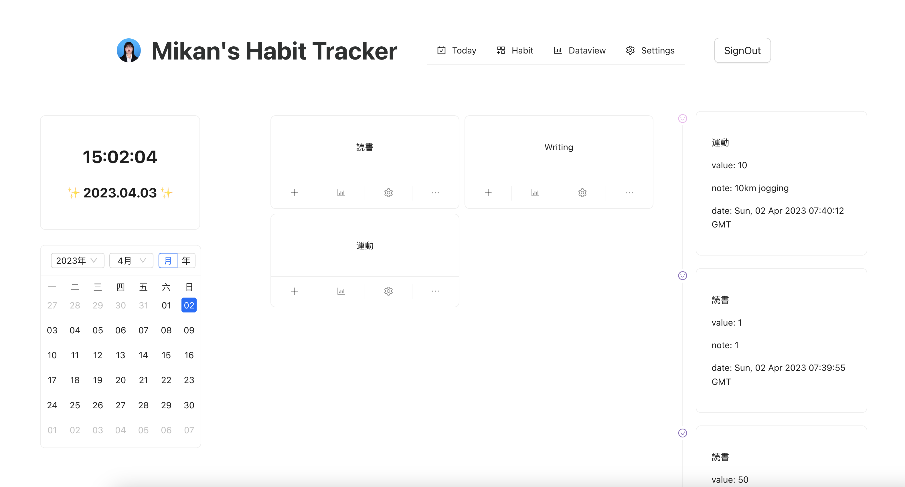

# Minimal-Habit-Tracker

## Introduction

This project is a habit tracker, using TypeScript, React and Firebase.

このプロジェクトは習慣トラッキングツールです。TypeScript、ReactとFirebaseの技術を使っています。

##  Features

- Login with Google account　グーグルアカウントでログイン
- Add and edit your habits 習慣の登録・変更
- Add data into each habit 習慣毎にデータ登録
- Data displayed in timeline データをタイムラインで表示
- Clock and calendar 時計とカレンダー

Other features in progress :)

他の機能も開発中 :)

## Capture キャプチャー

