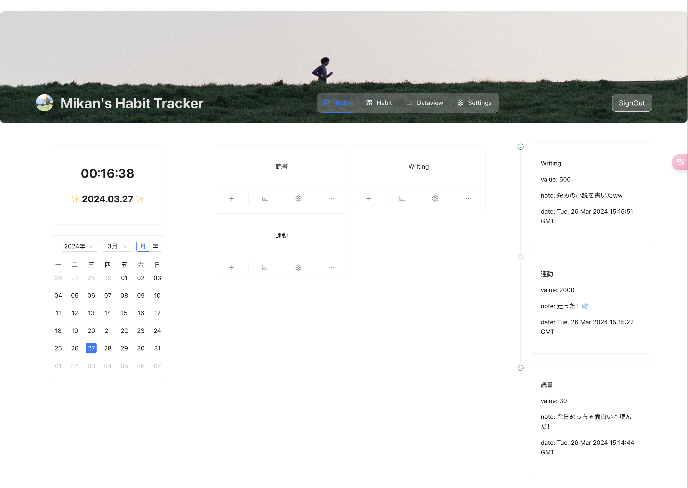
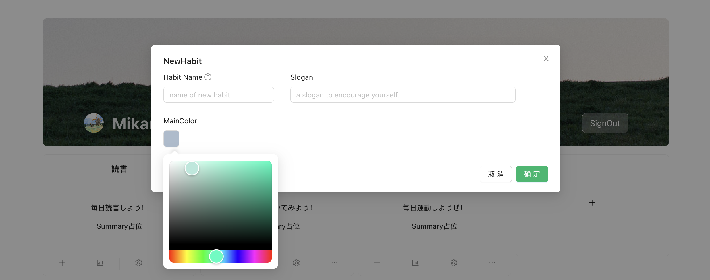

# Minimal-Habit-Tracker

## Introduction

This project is a habit tracker, using TypeScript, React and Firebase.

このプロジェクトは習慣トラッキングツールです。TypeScript、ReactとFirebaseの技術を使っています。

##  Features

### グーグルアカウントでログイン
  

ユーザがGoogleアカウントでログインすると、名前とアイコンが自動的に取得され、ユーザ独自のDashboard画面が表示されます。

データ画面などももちろん、ユーザ独自のデータが表示されます。

### 習慣の登録・変更

ユーザは自分の習慣、趣味、毎日の定例行事などを登録・変更できます。

Dashboard或いはデータ集計画面で、すべての習慣が一括表示され、把握しやすいです。

### 習慣毎にデータ登録

ユーザは毎回行事を完成する時に、完成分量や、メモなどのデータを登録できます。登録の時間も自動的に記録されます。

例えば、「読書」の習慣に、毎日ページ数、読書感想などを記録する。

### データをタイムラインで表示

習慣毎に、登録されたデータはタイムラインで表示されます。行動の枠を把握しやすいです。

### 時計とカレンダー

Dashboardでは、習慣と今日完成した分が表示されるだけでなく、時計とカレンダーも表示されます。

ユーザはこれを見て、よりうまく時間を把握し、今日残りの行動を調整しやすいです。

### 他の機能も開発中 :)

データ集計図表、目標設定、多言語対応、データインポート・エクスポートなどの機能も、積極的に開発中です。

## Capture キャプチャー

